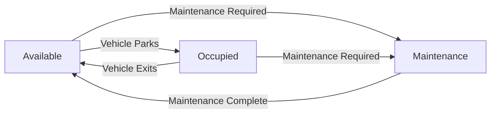

# 🚗 Smart Parking Management System

> A comprehensive Node.js backend solution for managing parking spaces with real-time tracking, automated billing, and slot maintenance features.

## ✨ Features

### 🏗️ **Parking Space Management**
- **Multi-Type Slot Support**: Regular, Compact, EV charging, and Handicap-accessible slots
- **Dynamic Slot Allocation**: Intelligent assignment based on vehicle type
- **Real-time Availability Tracking**: Live updates on slot availability

### 🚙 **Vehicle Management**
- **Vehicle Registration**: Support for cars, bikes, EVs, and handicap-accessible vehicles
- **Smart Slot Assignment**: Automatic allocation to appropriate slot types
- **Entry/Exit Tracking**: Complete session management with timestamps

### 💰 **Billing System**
- **Flexible Billing Options**: Hourly rates and Day-Pass options
- **Tiered Pricing Structure**:
  - ≤ 1 hour: ₹50
  - ≤ 3 hours: ₹100
  - ≤ 6 hours: ₹150
  - > 6 hours: ₹200
  - Day-Pass: ₹150 (flat rate)
- **Revenue Tracking**: Automatic calculation of total earnings

### 🔧 **Maintenance Management**
- **Slot Maintenance Mode**: Mark slots for maintenance with automatic session closure
- **Service Notifications**: 6-hour parking alerts for long-duration stays

### 📊 **Session Management**
- **Active Session Monitoring**: Track all currently parked vehicles
- **Complete History**: Full records of all parking sessions
- **Real-time Status Updates**: Live session status tracking

## 🛠️ Tech Stack

| Technology | Purpose |
|------------|---------|
| **Node.js** | Runtime environment |
| **Express.js** | Web framework |
| **MongoDB** | Database |
| **Mongoose** | ODM for MongoDB |
| **CORS** | Cross-origin resource sharing |

## 📁 Project Structure

```
src/
├── controllers/           # Business logic
│   ├── parkingSpace.controller.js
│   ├── session.controller.js
│   ├── slot.controller.js
│   └── vehicle.controller.js
├── routes/               # API route definitions
│   ├── parkingSpace.routes.js
│   ├── session.routes.js
│   ├── slot.routes.js
│   └── vehicle.routes.js
├── schema/               # Database models
│   ├── parkingSpace.model.js
│   ├── session.model.js
│   ├── slot.model.js
│   └── vehicle.model.js
├── utils/                # Utility functions
│   ├── cronJobs.js
│   └── nearestParking.js
├── db/                   # Database configuration
│   └── index.js
├── app.js               # Express app setup
└── server.js            # Server entry point
```

## 🚀 Quick Start

### Prerequisites
- Node.js (v14 or higher)
- MongoDB
- npm or yarn

### Installation

1. **Clone the repository**
   ```bash
   git clone <your-repo-url>
   cd parking-management-system
   ```

2. **Install dependencies**
   ```bash
   npm install
   ```

3. **Environment Setup**
   Create a `.env` file in the root directory:
   ```env
   DB_CONNECTIONSTRING=mongodb://localhost:27017
   DB_NAME=parking_system
   QSTASH_TOKEN=your_qstash_token_here
   ```

4. **Start the server**
   ```bash
   npm start
   ```

5. **Initialize parking space**
   ```bash
   curl -X POST http://localhost:8000/api/parking-space/initialize
   ```

The server will start on `http://localhost:8000` 🎉

## 📡 API Endpoints

### 🏗️ Parking Space Management
```http
POST   /api/parking-space/initialize  # Initialize parking with default slots
GET    /api/parking-space/get         # Get parking space details
```

### 🚗 Vehicle Operations
```http
POST   /api/vehicle/register          # Register and park a vehicle
POST   /api/vehicle/exit/:sessionId   # Exit vehicle and calculate billing
GET    /api/vehicle/get/:vehicleId    # Get vehicle details
```

### 🔧 Slot Management
```http
GET    /api/slot/get                  # Get all slots with their status
POST   /api/slot/mantainance/:slotId  # Mark slot for maintenance
```

### 📊 Session Tracking
```http
GET    /api/sessions/get              # Get all active sessions
GET    /api/sessions/gets             # Get all sessions (active + completed)
GET    /api/sessions/notifySixHours   # Check for 6+ hour sessions
```

## 💡 Usage Examples

### Register a Vehicle
```bash
curl -X POST http://localhost:8000/api/vehicle/register \
  -H "Content-Type: application/json" \
  -d '{
    "number": "ABC123",
    "vehicleType": "car",
    "billingType": "Hourly"
  }'
```

### Exit a Vehicle
```bash
curl -X POST http://localhost:8000/api/vehicle/exit/SESSION_ID
```

### Mark Slot for Maintenance
```bash
curl -X POST http://localhost:8000/api/slot/mantainance/SLOT_ID
```

## 🏗️ Database Schema

### Slot Types & Capacity
- **Regular Slots**: 10 slots (R01-R10) - For cars
- **Compact Slots**: 10 slots (C01-C10) - For bikes
- **EV Slots**: 5 slots (E01-E05) - For electric vehicles
- **Handicap Slots**: 5 slots (H01-H05) - For handicap-accessible vehicles

### Vehicle Type Mapping
| Vehicle Type | Assigned Slot Type |
|-------------|--------------------|
| Car | Regular |
| Bike | Compact |
| EV | EV |
| Handicap-Accessible | Handicap-Accessible |

## 🔄 Slot Status Flow



## 🚨 Error Handling

The system includes comprehensive error handling for:
- ✅ Invalid vehicle types
- ✅ Slot unavailability
- ✅ Session not found
- ✅ Database connection issues
- ✅ Validation errors

## 🔮 Future Enhancements

- [ ] **Payment Integration**: Online payment processing
- [ ] **Mobile App**: Flutter/React Native mobile application
- [ ] **Analytics Dashboard**: Real-time parking analytics
- [ ] **Reservation System**: Advance slot booking
- [ ] **IoT Integration**: Sensor-based slot detection
- [ ] **Multi-location Support**: Manage multiple parking facilities

## 🤝 Contributing

1. Fork the repository
2. Create a feature branch (`git checkout -b feature/amazing-feature`)
3. Commit your changes (`git commit -m 'Add amazing feature'`)
4. Push to the branch (`git push origin feature/amazing-feature`)
5. Open a Pull Request

## 📄 License

This project is licensed under the MIT License - see the [LICENSE](LICENSE) file for details.

## 👨‍💻 Author

**Your Name**
- GitHub: [@yourusername](https://github.com/yourusername)
- LinkedIn: [Your LinkedIn](https://linkedin.com/in/yourprofile)

---

<div align="center">
  <p>Made with ❤️ and ☕</p>
  <p>⭐ Star this repo if you found it helpful!</p>
</div>
